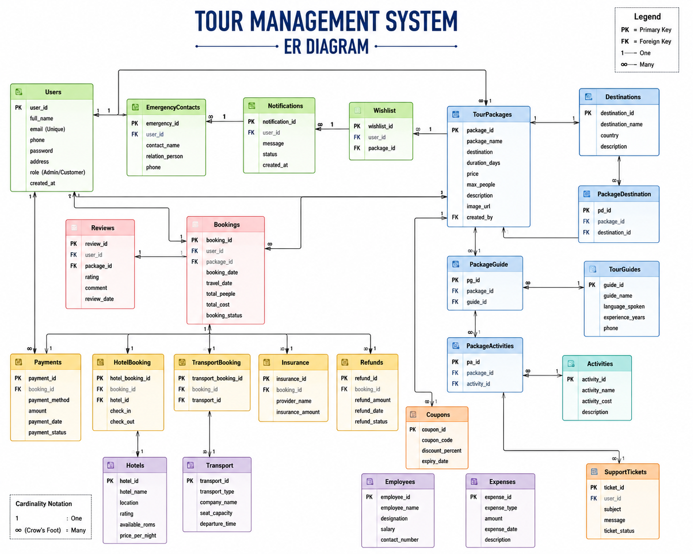

# 🗺️ Tour Management System

<div align="center">


A complete **Database Management System (DBMS)** project developed using **C++ (Object-Oriented Programming)** and **MySQL**.

Designed for efficient management of tour packages, bookings, hotels, payments, transport, tour guides, reviews, refunds, and administrative operations.

</div>

---

# 📖 Project Overview

The **Tour Management System** is a console-based application developed using **C++** and **MySQL**. It automates the complete tour booking process by allowing customers to browse tour packages, book tours, make payments, submit reviews, and manage reservations.

The system also provides a powerful **Admin Panel** to manage customers, packages, hotels, transport, tour guides, bookings, payments, refunds, and reports.

---

# ✨ Key Features

## 🔐 User Authentication

- Secure Login System
- Admin & Customer Roles
- Role-based Access Control

## 🎒 Tour Package Management

- View Tour Packages
- Add Package
- Update Package
- Delete Package
- Search Packages

## 📅 Booking Management

- Book Tour Packages
- View Booking History
- Cancel Booking
- Booking Confirmation

## 💳 Payment Management

- Make Payments
- Payment Status
- Payment History
- Invoice Generation

## 🧾 Invoice Generation

- Booking Summary
- Customer Details
- Package Details
- Total Cost

## ⭐ Review System

- Rating (1–5)
- Customer Reviews
- Comments

## 🏨 Hotel Management

- Hotel Information
- Hotel Booking

## 🚌 Transport Management

- Transport Information
- Transport Booking

## 🧑‍💼 Tour Guide Management

- Guide Information
- Package Guide Assignment

## 💰 Refund Management

- Refund Request
- Refund Approval
- Refund Status

## 🔔 Notification System

Implemented using **MySQL Trigger**.

Whenever a customer books a package, the system automatically creates a notification.

## 📊 Reports & Statistics

- Revenue Report
- Booking Statistics
- Customer Statistics
- Payment Statistics

## 💾 File Handling

- Save Booking Data
- Load Booking Data

---

# 🛠 Technologies Used

| Technology | Purpose |
|------------|----------|
| C++ | Console Application |
| OOP | Object-Oriented Programming |
| MySQL | Database Backend |
| MySQL Workbench | Database Design |
| Git | Version Control |
| GitHub | Repository Hosting |

---

# 🗄 Database Concepts

- Primary Key
- Foreign Key
- Constraints
- Views
- Stored Procedures
- Triggers
- Indexing
- Relationships
- Normalization

---

# 📚 Database Modules

- Users
- Tour Packages
- Destinations
- Bookings
- Payments
- Hotels
- Transport
- Tour Guides
- Reviews
- Coupons
- Wishlist
- Notifications
- Insurance
- Activities
- Refunds
- Support Tickets

---

# 📁 Project Structure

```text
Tour_Management_System
│
├── main.cpp
├── tour_Management.sql
├── README.md
├── LICENSE
├── Project_Report.pdf
│
├── docs
│   ├── ER_Diagram.png
│   ├── Relational_Schema.png
│   └── Prisma_Diagram.png
│
└── screenshots
    ├── login.png
    ├── admin_menu.png
    ├── customer_menu.png
    ├── booking.png
    ├── payment.png
    └── statistics.png
```

---

# 🖼 Database Design

## ER Diagram



---

## Relational Schema


---

## Prisma Diagram


---

# 📸 Project Screenshots

## 🔐 Login Page


---

## 👤 Customer Menu


---

## 👨‍💼 Admin Menu


---

## 📅 Booking Module


---

## 💳 Payment Module


---

## 📊 Statistics Dashboard


---

# ▶️ How to Run

### Clone Repository

```bash
git clone https://github.com/Motiursd/SQL-Projects.git
cd SQL-Projects/Tour_Management_System
```

### Import Database

```sql
SOURCE tour_Management.sql;
```

### Compile

```bash
g++ main.cpp -o TourManagement
```

### Run

Linux

```bash
./TourManagement
```

Windows

```bash
TourManagement.exe
```

---

# 🔑 Demo Login

## 👑 Admin

Email

```
admin@gmail.com
```

Password

```
admin123
```

---

## 👤 Customer

Email

```
motiur@gmail.com
```

Password

```
12345
```

---

# 🚀 Future Improvements

- Online Payment Gateway
- Email Notification
- QR Code Ticket
- PDF Invoice
- Password Encryption
- Customer Registration
- Search & Filter
- Analytics Dashboard
- Mobile Application
- Cloud Database Support

---

# 🎓 Learning Outcomes

- Database Management System
- Object-Oriented Programming
- SQL Programming
- MySQL Integration
- File Handling
- Software Engineering
- Database Design

---

# 👨‍💻 Developer

**Md. Motiur Rahman**

**Student ID:** C243119

Department of Computer Science & Engineering (CSE)

International Islamic University Chittagong (IIUC)

**Course:** Database Management Systems Lab

**Course Code:** CSE 2424

**Course Teacher:** Mizanur Rahman

**GitHub:** https://github.com/Motiursd

---

# 📄 License

This project was developed for academic purposes as part of the **Database Management Systems (CSE 2424)** laboratory course.

---

<div align="center">

## ⭐ If you found this project helpful, please consider giving it a Star!

Thank you for visiting this repository.

</div>
